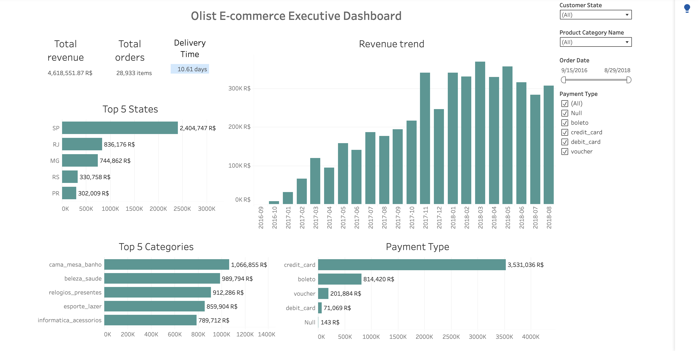
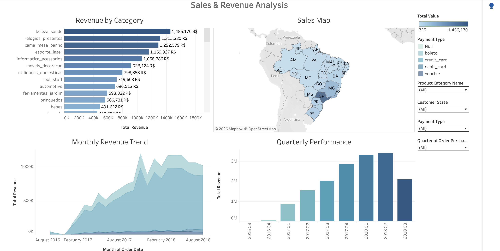
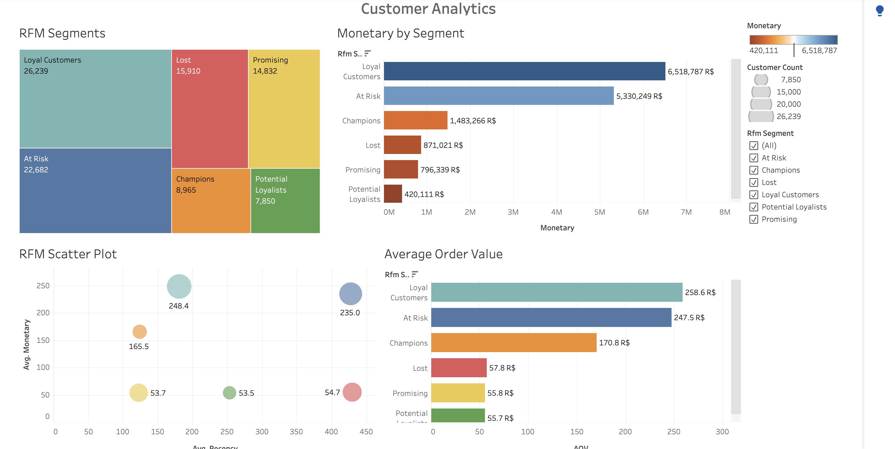

# Olist E-commerce: Tableau Dashboards

Interactive business intelligence dashboards analyzing 100K+ orders from Brazilian e-commerce marketplace.
---

## Live Dashboards

**[View Interactive Dashboards on Tableau Public](https://public.tableau.com/app/profile/yuliia.lekh/vizzes))**

---

## Project Overview

Three comprehensive Tableau dashboards providing actionable insights:

1. **Executive Dashboard** - KPIs, revenue trends, top performers
2. **Sales & Revenue Analysis** - Geographic breakdown, category performance
3. **Customer Analytics** - RFM segmentation, customer value analysis

**Dataset:** [Olist Brazilian E-commerce (Kaggle)](https://www.kaggle.com/datasets/olistbr/brazilian-ecommerce)  
**Scope:** 96,478 orders | R$16.1M revenue | 96K customers | 27 states | Sept 2016 - Aug 2018

---

## Executive Summary: Critical Findings

### High-Priority Business Issues

**Revenue Concentration Risk**
- **37.5% dependency** on single state (São Paulo: R$6.0M)
- Geographic diversification urgent to mitigate regional economic/logistics shocks

**Customer Retention Crisis**  
- **22,682 "At Risk" customers** (24% of base) — formerly frequent buyers now inactive
- **R$5.3M in lifetime value** at stake — immediate win-back campaign required
- **~95% one-time buyers** overall — indicates fundamental retention problem

**Growth Opportunities**
- **60x revenue growth** achieved (Sept '16: R$20K → Nov '17: R$1.2M monthly)
- **Northern Brazil untapped** (<2% revenue, 15M population) — logistics partnership opportunity
- **Champions segment** underutilized (9% of customers, high LTV) — VIP program potential

---

## Dashboard 1: Executive Overview

**Strategic Risk:**
> São Paulo = 37.5% revenue. Truck driver strike (2018 precedent), port closure, or regional economic downturn → immediate 37% revenue impact with no geographic buffer.

**Mitigation Strategy:**
- Accelerate expansion in RS/PR (high GDP per capita, currently underserved)
- Partner with regional carriers for Northern states penetration
- Target 25% max concentration per state within 18 months

---

### Payment Method Insights

**Distribution:**
- **Credit Card:** R$ 12,381,251 (77%) — Instant settlement, 2.5-4% processing fees
- **Boleto:** R$ 2,769,933 (17%) — Bank slip, 1-3 day delay, serves unbanked segment
- **Voucher/Debit:** R$ 963,835 (6%)

---

### Category Portfolio: Diversification Strength

**Portfolio Insight:**
> No category exceeds 10% of revenue. 
> 
> **Advantage:** Recession-resistant — downturn in one category doesn't threaten business viability.
> **Trade-off:** Harder to achieve category leadership positioning.

---

## Dashboard 2: Sales & Revenue Analysis

### Geographic Heat Map: Infrastructure Correlation

**Key Observation:**
- **Dark blue** (high revenue): SP, RJ, MG, RS — Southeast/South coastal states
- **Light blue** (low revenue): Northern interior states (AM, PA, RO, AC)
- **Nearly invisible:** Roraima (RR), Amapá (AP)

**Root Cause Analysis:**
> Revenue distribution = **inverse** of logistics costs.
> 
> **Shipping Cost Comparison:**
> - São Paulo → São Paulo: R$ 15 (truck, 1-2 days)
> - São Paulo → Manaus (AM): R$ 50-75 (air freight, 7-14 days)
> 
> **Result:** Sellers exclude Northern states from listings → reduced product availability → suppressed demand
> 
> **Critical Insight:** This is NOT a demand problem (Northern Brazil has 15M population, growing GDP) — it's a **supply-side infrastructure constraint**

---

### Revenue Growth: Marketplace Network Effects

**Growth Trajectory:**
- **Sept 2016:** R$ 20K monthly (baseline)
- **Nov 2017:** R$ 1,200K monthly (peak)
- **Growth:** 60x in 15 months = **650% CAGR**

**Benchmarking:**
- Global e-commerce average (2016-2018): 20-25% annual growth
- Olist growth: **26x faster than market**

**Marketplace Flywheel Explanation:**
> 1. More sellers → More product variety
> 2. More products → More customer traffic
> 3. More customers → Attract additional sellers
> 4. Repeat → Exponential growth (network effects)
> 
> **Pattern Observed:** Classic hypergrowth phase of two-sided marketplace. 

---

### Quarterly Performance: Q4 2018 Warning Signal

**From Bar Chart:**
- **Q3 2018:** R$ 3.7M (peak)
- **Q4 2018:** R$ 2.1M (↓43% drop)

**Possible Explanations:**
1. **Dataset limitation:** Collection ended mid-Q4 (incomplete data)
2. **Economic factor:** Brazil Oct 2018 election → consumer uncertainty
3. **Competition:** Mercado Livre aggressive holiday promotions
4. **Platform issue:** Technical problem or payment gateway failure

**Required Action for Real Business:**
- Cohort analysis: Did Q3 customers return in Q4 or churn permanently?
- Customer survey: "Why did you reduce/stop purchases?"

---

## Dashboard 3: Customer Analytics (RFM Segmentation)

### RFM Segment Distribution

| Segment | Customers | % | Total Value | Avg Value | Priority |
|---------|-----------|---|-------------|-----------|----------|
| **Loyal Customers** | 26,239 | 27% | R$ 6,518,787 | R$ 248 | 🟢 Nurture |
| **At Risk** | 22,682 | 24% | R$ 5,330,249 | R$ 235 | 🔴 Win-back |
| **Lost** | 15,910 | 17% | R$ 871,021 | R$ 55 | ⚪ Low priority |
| **Promising** | 14,832 | 15% | R$ 796,339 | R$ 54 | 🟡 Convert |
| **Champions** | 8,965 | 9% | R$ 1,483,266 | R$ 165 | 💎 VIP |
| **Potential Loyalists** | 7,850 | 8% | R$ 420,111 | R$ 54 | 🟢 Nurture |

---

### Crisis Alert: "At Risk" Segment Emergency

**The Problem:**
> **22,682 customers (24% of base)** = second-largest segment
> 
> **"At Risk" Definition:**
> - **High Frequency:** 3+ historical orders (proven buyers)
> - **High Monetary:** R$ 200+ lifetime spend (can afford to buy)
> - **High Recency:** 60-120 days inactive (stopped buying recently)

**Translation:** Former good customers who suddenly stopped — NOT gradual fade, but **trigger event**

**Financial Impact:**
- **Aggregate value:** R$ 5,330,249
- **Estimated LTV at risk:** R$ 5.3M+ if permanent churn

---

### Cohort Retention: Fundamental Challenge

**Finding from Dataset Analysis:**
> **~95% of customers make only ONE purchase** — cohort data shows minimal repeat purchase behavior.

**What This Reveals:**

**Marketplace Model Constraint:**
- Customers loyal to **sellers**, not platform
- Next purchase: Google search → lands on competitor (Mercado Livre, Amazon)
- No lock-in mechanism (unlike Amazon Prime subscription)

**Financial Impact:**
- High customer acquisition cost (CAC) ÷ 1.05 lifetime orders = **expensive** per-order economics
- Lifetime value (LTV) severely limited by single purchase

**Recommendation:**
> Implement retention mechanisms:
> 1. **Subscription tier:** "Olist Plus" (free shipping lock-in)
> 2. **Loyalty program:** Points/cashback for repeat purchases
> 3. **First purchase follow-up:** Automated email 30 days post-purchase with personalized recommendations
> 4. **Re-engagement triggers:** "Your favorite seller has new products"

---

**Skills Demonstrated:**
- Business Intelligence & Data Storytelling
- Customer Segmentation (RFM methodology)
- Financial Impact Analysis & ROI Modeling
- Geographic Market Analysis
- Retention Strategy Development

---

## Tech Stack

- **PostgreSQL** - Data transformation
- **Tableau Public** - Visualization
- **SQL** - RFM analysis, aggregations

---

## Related Projects

**[SQL Analysis Repository](https://github.com/YuliiaLekh/olist-sql-analysis)** - Exploratory data analysis and SQL queries for this dataset

---

## Author

**Yuliia Lekh**  
Aspiring Data Analyst | Tableau | SQL | Python

📧 [julia.030872@gmail.com](mailto:julia.030872@gmail.com)  
💼 [LinkedIn](https://www.linkedin.com/in/yuliia-lekh-ab73ab238/)  
📊 [Tableau Public](https://public.tableau.com/app/profile/yuliia.lekh/vizzes)

---

## License

Data: [Olist Dataset](https://www.kaggle.com/datasets/olistbr/brazilian-ecommerce) (CC BY-NC-SA 4.0)
